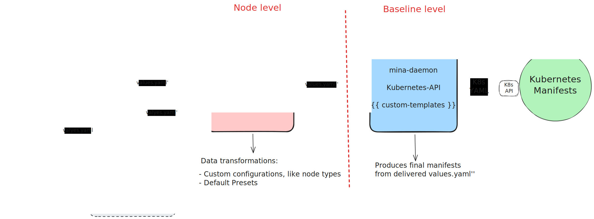

# Mina Daemon Chart

> **Note**: This chart is forked from o1Labs' mina-standard-daemon chart and has been generalized for community use.

## Overview

This Chart transforms a baseline Helm Chart by adding Mina daemon-specific fields and custom Library Functions.

It keeps fields as configurable as possible; leaving space for Type testing. But relevantly, it allows great flexibility, which is exploited by other APIs/Charts to perform complex configurations from different `values.yaml` particular to different Mina Nodes.

The inspiration are Bitnami Charts, which provide a solid baseline rooted on the Kubernetes API i.e., one can fully configure Deployments via e.g., `extraEnv` or `extraContainer` fields in their Charts; this would make our charts:
- **Stable**: we are configuring "values" to a single baseline Chart, which can be debugged and tested independently.
- **Extendable**: other Charts may use this as baseline and provide their own set of Libraries or Values to yield a particular configuration.
- **Ready to go**: as we keep using the same tooling (i.e., Helm and `helmfile`), we can progressively roll-out when releases are ready.

> **Key Takeaway**: **Mina Daemon Chart is a Helm Chart** that "higher-level" abstractions (such as other `helmfiles`, like [mina-node-orchestrator](../mina-node-orchestrator/README.md)) use as baseline Chart to produce Mina Node Kubernetes Manifests using comprehensible defaults and bespoke templates.

## Architecture
`helmfile` is a tool that allow us to transform the *Values* we provide to Helm Charts, easing configuration and deployment management. This is achieved via complimentary template functions and deployment control (e.g., via `needs` to create DAG deployments), effectively acting as an Umbrella Configuration Manager, or **Orchestrator**.

Helm Charts are the final "engine" producing Kubernetes Manifests. These use *Values* provided upstream (e.g., via a file, or via `helmfile`) to fill a set of *Helm Templates*.

**Mina Daemon Chart is a Helm Chart** that "higher-level" abstactions (such as other `helmfiles`, like [mina-node-orchestrator](../mina-node-orchestrator/README.md)) use as baseline Chart to produce Mina Node Kubernetes Manifests using comprehensible defaults and bespoke templates.

### A layered approach
The figure below provides a high-level overview of the layered approach used to effectively produce Mina nodes Kubernetes Manifests using Helm and `helmfile`.

The proposed approach delimits functionality via abstraction levels, as well as defines a standard workflow. This is described below, looking at the figure from left to right:

1. Users use Orchestration level APIs. These include all, allowing maximum control over what is to be deployed. There is an optional Orchestrator Chart, which may be used to add more custom functions before propagating them downstream.
2. The default values for a *node type* are over-written by Orchestration level values. Node level custom templates inject coupled values for e.g., add initContainers for runtime configuration download, add required Secrets, etc.
3. The Baseline level is entirely composed of the `mina-daemon-chart` Chart. It defines the Kubernetes Manifest fields to expose, as well as adds some Mina Daemon-specific fields, such as `.Values.daemon`, etc.

## Values

| Parameter | Description | Default |
|-----------|-------------|---------|
| nameOverride | Override the chart name | `""` |
| fullnameOverride | Override the full chart name | `""` |
| restartPolicy | Sets the restart policy for the Pod | `"Always"` [Restart Policy](https://kubernetes.io/docs/concepts/workloads/pods/pod-lifecycle/#restart-policy) |
| strategy | Sets up the Pod update strategy | `{}` [Deployment Strategy](https://kubernetes.io/docs/concepts/workloads/controllers/deployment/#strategy) |
| imagePullSecrets | Secrets for pulling images from private repositories | `[]` [Pull Image Private Registry](https://kubernetes.io/docs/tasks/configure-pod-container/pull-image-private-registry/) |
| podAnnotations | Kubernetes Annotations for the Pod | `{}` [Annotations](https://kubernetes.io/docs/concepts/overview/working-with-objects/annotations/) |
| podLabels | Kubernetes Labels for the Pod | `{}` [Labels](https://kubernetes.io/docs/concepts/overview/working-with-objects/labels/) |
| podSecurityContext | Pod-level security context | `{}` [Pod Security Context](https://kubernetes.io/docs/reference/generated/kubernetes-api/v1.29/#podsecuritycontext-v1-core) |
| secrets | Create Secrets directly from this Chart | `[]` |
| secrets.secretsAnnotations | Annotations for all Secrets to be created | `app.minaprotocol.org/baseline-chart: mina-daemon-chart` |
| secrets.secrets | List of `{'name':'';'labels':{};'data':{'key':'value'}}` objects | [] |
| serviceAccount.create | Specifies whether a service account should be created | `true` |
| serviceAccount.automount | Automatically mount a ServiceAccount's API credentials | `true` |
| serviceAccount.annotations | Annotations to add to the service account | `{}` |
| serviceAccount.name | The name of the service account to use | `""` |
| initContainers | Setup for init containers | `[]` |
| extraInitContainers | Setup for extra init containers | `[]` |
| daemon.name | Name of the daemon container | `"mina-daemon"` |
| daemon.network | Name of the network | `"devnet"` |
| daemon.role | `mina-node-orchestrator` role. Used for labels and exported metrics | `"plain"` |
| daemon.replicas | Number of replicas (only supported for 'snarkWorker' role) | `1` |
| daemon.image.repository | Repository for the daemon image | `"mina-daemon"` |
| daemon.image.pullPolicy | Pull policy for the daemon image | `"IfNotPresent"` [Container Images](https://kubernetes.io/docs/concepts/containers/images/) |
| daemon.image.tag | Tag for the daemon image | `"0.0.1"` |
| daemon.command | Command to run in the daemon container | `[]` [Define Command and Arguments for a Container](https://kubernetes.io/docs/tasks/inject-data-application/define-command-argument-container/) |
| daemon.args | Arguments to run in the daemon container | `[]` [Define Command and Arguments for a Container](https://kubernetes.io/docs/tasks/inject-data-application/define-command-argument-container/) |
| daemon.extraArgs | Extra arguments appended to the command and args fields | `[]` |
| daemon.securityContext | Security context for the daemon container | `{}` [Security Context](https://kubernetes.io/docs/reference/generated/kubernetes-api/v1.29/#securitycontext-v1-core) |
| daemon.env | Environment variables for the daemon container | `[]` [Define Environment Variables for a Container](https://kubernetes.io/docs/tasks/inject-data-application/define-environment-variable-container/) |
| daemon.extraEnv | Extra environment variables for the daemon container | `[]` |
| daemon.ports | Ports for the daemon container | `[]` [Defining a Service](https://kubernetes.io/docs/concepts/services-networking/service/#defining-a-service) |
| daemon.extraPorts | Extra ports for the daemon container | `[]` |
| daemon.resources | Resource limits and requests for the daemon container | `{}` |
| daemon.livenessProbe | Liveness probe for the daemon container | `{}` [Configure Liveness, Readiness and Startup Probes](https://kubernetes.io/docs/tasks/configure-pod-container/configure-liveness-readiness-startup-probes/) |
| daemon.readinessProbe | Readiness probe for the daemon container | `{}` [Configure Liveness, Readiness and Startup Probes](https://kubernetes.io/docs/tasks/configure-pod-container/configure-liveness-readiness-startup-probes/) |
| daemon.volumeMounts | Volume mounts for the daemon container | `[]` |
| daemon.extraVolumeMounts | Extra volume mounts for the daemon container | `[]` |
| extraContainers | Setup for extra containers | `[]` [Init Containers](https://kubernetes.io/docs/concepts/workloads/pods/init-containers/) |
| service.enable | Enable the use of a service | `true` |
| service.annotations | Service annotations | `{}` |
| service.type | Type of the service | `"ClusterIP"` [Publishing Services (Service Types)](https://kubernetes.io/docs/concepts/services-networking/service/#publishing-services-service-types) |
| service.port | Port for the service | `80` |
| service.targetPort | Target port for the service | `"http"` |
| service.protocol | Protocol for the service | `"TCP"` |
| service.name | Name of the service port | `"http"` |
| service.extraPorts | Extra ports for the service | `[]` |
| extraServices | Additional services to be created. Supports custom selectors via `skipSelectorLabels` and `selector` fields, allowing deployment of helper services that bypass default PodSelector labels | `[]` |
| ingress.enable | Enable ingress | `false` |
| ingress.ingressClassName | Ingress class name | `"nginx"` |
| ingress.annotations | Annotations for the ingress | `{}` |
| ingress.hosts | Hosts configuration for the ingress | See values.yaml for structure |
| ingress.tls | TLS configuration for the ingress | `[]` |
| extraIngress | Additional ingress resources to be created | `[]` |
| volumes | Additional volumes on the output Deployment definition | `[]` |
| extraVolumes | Extra volumes to be added | `[]` |
| persistentVolumeClaim.enable | Enable persistent volume claim | `false` |
| persistentVolumeClaim.name | Name of the persistent volume claim | `""` |
| persistentVolumeClaim.annotations | Annotations for the persistent volume claim | `{}` |
| persistentVolumeClaim.accessMode | Access mode for the persistent volume claim | `"ReadWriteOnce"` |
| persistentVolumeClaim.storageClassName | Storage class name for the persistent volume claim | `"standard"` |
| persistentVolumeClaim.size | Size of the persistent volume claim | `"5Gi"` |
| nodeSelector | Node selector for the pod | `{}` [Assigning Pods to Nodes](https://kubernetes.io/docs/concepts/scheduling-eviction/assign-pod-node/#nodeselector) |
| tolerations | Tolerations for the pod | `[]` [Taints and Tolerations](https://kubernetes.io/docs/concepts/scheduling-eviction/taint-and-toleration/) |
| affinity | Affinity settings for the pod | `{}` [Assigning Pods to Nodes](https://kubernetes.io/docs/concepts/scheduling-eviction/assign-pod-node/#affinity-and-anti-affinity) |
| postgresql.enable | Enable PostgreSQL as dependency chart | `false` [Bitnami PostgreSQL Chart](https://github.com/bitnami/charts/tree/main/bitnami/postgresql) |

