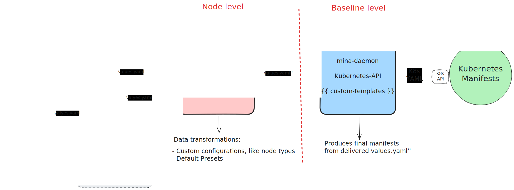

# Mina Node Orchestrator

> **Note**: This chart is forked from o1Labs' mina-standard-node chart and has been generalized for community use.

## Overview

Essentially, this is a collection of `helmfile` templates that are used to generate a set of **Values** for the `mina-daemon-chart` Helm Chart.

Referring to the [proposed architecture](../mina-daemon-chart/README.md) (see figure below), this is a **Node level** abstraction, that deals with coupling of settings and other transformations to render a working set of Kubernetes Manifest for a particular Mina Node *type*.

## How is `mina-node-orchestrator` structured?
- `environment/defaults.yaml`: is a collection of "constants", or environment-level values used by the templates in `templates/`. These values are over-written by any `values.yaml` provided at Orchestration level. `defaults.yaml` defines the Node-level API schema, as well as default values.
- `_helpers.tpl`: collection of Helm Template functions. These are used to efficiently generate YAML. Helpers are invoked from `templates/`.
- `templates/`: another collection of Helm Template functions, these ones are invoked per-release in `helmfile.yaml` (i.e., the Orchestration file) and are responsible shaping values for the downstream Chart.
- `helmfile.yaml`: the **Orchestration file**. It essentially loads the environment definition (i.e., `environment/defaults.yaml`) and generates `helmfile` releases for each `.Values.nodes` defined.

## Configuration Parameters

The following table lists the configurable parameters of the Mina Node Orchestrator and their default values.

| Parameter | Description | Type | Default |
|-----------|-------------|------|---------|
| `global.namespace` | Global namespace for the deployment | string | `"mina"` |
| `global.network` | Global network name | string | `"devnet"` |
| `common.tolerations` | Common tolerations for node scheduling | list | `[]` |
| `common.affinity` | Common affinity rules for node scheduling | object | `{}` |
| `common.daemon.image.repository` | Repository for the Mina daemon image | string | `"minaprotocol/mina-daemon"` |
| `common.daemon.image.pullPolicy` | Image pull policy for the Mina daemon | string | `"IfNotPresent"` |
| `common.daemon.image.tag` | Tag for the Mina daemon image | string | `"3.0.4-alpha2-b8cdab0-bullseye-devnet"` |
| `common.daemon.peerListUrl` | Peer list URL for the daemon | string | `""` |
| `common.daemon.volumeMounts` | Common volume mounts for the daemon | list | `[]` |
| `common.daemon.env.MINA_CLIENT_TRUSTLIST` | Client trustlist for Mina | string | `"10.0.0.0/8"` |
| `common.daemon.envFromSecret` | Common environment variables from secrets | list | `[]` |
| `common.daemon.init.libp2pKeys.password` | Password for libp2p keys initialization | string | `""` |
| `common.daemon.ports` | Common port configurations for the daemon | object | `{}` |
| `common.volumes` | Common volumes configuration | list | `[]` |
| `defaults.plain.needs` | Dependencies for plain node template | list | `[]` |
| `defaults.plain.templates` | Templates used for plain node | list | `["templates/plain.yaml.gotmpl"]` |
| `defaults.plain.values.secrets` | Secrets configuration for plain node | list | `[]` |
| `defaults.plain.values.debug` | Debug mode for plain node | boolean | `false` |
| `defaults.plain.values.ingress.enable` | Enable ingress for plain node | boolean | `false` |
| `defaults.plain.values.daemon.ports.external.name` | External port name | string | `"external-port"` |
| `defaults.plain.values.daemon.ports.external.protocol` | External port protocol | string | `"TCP"` |
| `defaults.plain.values.daemon.ports.external.containerPort` | External port container port | number | `10005` |
| `defaults.plain.values.daemon.ports.external.hostPort` | External port host port | number | `10005` |
| `defaults.plain.values.daemon.ports.client.name` | Client port name | string | `"client-port"` |
| `defaults.plain.values.daemon.ports.client.protocol` | Client port protocol | string | `"TCP"` |
| `defaults.plain.values.daemon.ports.client.containerPort` | Client port container port | number | `8301` |
| `defaults.plain.values.daemon.ports.graphql.name` | GraphQL port name | string | `"graphql-port"` |
| `defaults.plain.values.daemon.ports.graphql.protocol` | GraphQL port protocol | string | `"TCP"` |
| `defaults.plain.values.daemon.ports.graphql.containerPort` | GraphQL port container port | number | `3085` |
| `defaults.plain.values.daemon.ports.metrics.name` | Metrics port name | string | `"metrics-port"` |
| `defaults.plain.values.daemon.ports.metrics.protocol` | Metrics port protocol | string | `"TCP"` |
| `defaults.plain.values.daemon.ports.metrics.containerPort` | Metrics port container port | number | `8081` |
| `defaults.plain.values.daemon.env` | Environment variables for plain node daemon | object | `{}` |
| `defaults.plain.values.daemon.envFromSecret` | Environment variables from secrets for plain node | list | `[]` |
| `defaults.plain.values.daemon.extraArgs` | Extra arguments for daemon command | list | `[]` |
| `defaults.plain.values.daemon.init.enable` | Enable init containers for plain node | boolean | `true` |
| `defaults.plain.values.daemon.init.libp2pKeys.password` | Password for libp2p keys | string | `""` |
| `defaults.plain.values.daemon.init.libp2pKeys.fromSecret` | Use secret for libp2p keys | boolean | `false` |
| `defaults.plain.values.daemon.init.libp2pKeys.secret.name` | Secret name for libp2p keys | string | `"mina-libp2p-keys"` |
| `defaults.plain.values.daemon.init.genesis.fromSecret` | Use secret for genesis config | boolean | `false` |
| `defaults.plain.values.daemon.init.genesis.secret.name` | Secret name for genesis config | string | `"a-secret"` |
| `defaults.plain.values.daemon.init.genesis.secret.key` | Secret key for genesis config | string | `"a-genesis-config.json"` |
| `defaults.plain.values.daemon.init.keys.password` | Password for node keys | string | `""` |
| `defaults.plain.values.daemon.init.keys.fromSecret` | Use secret for node keys | boolean | `false` |
| `defaults.plain.values.daemon.init.keys.secret.name` | Secret name for node keys | string | `"mina-keys"` |
| `defaults.plain.values.extraInitContainers` | Extra init containers to add to the pod | list | `[]` |
| `defaults.plain.values.daemon.persistence.enable` | Enable persistence for plain node | boolean | `false` |
| `defaults.plain.values.daemon.persistence.annotations` | Annotations for persistence | object | `{}` |
| `defaults.plain.values.daemon.persistence.claim.storageClassName` | Storage class for persistence volume | string | `"openebs-hostpath"` |
| `defaults.plain.values.daemon.persistence.claim.size` | Size of persistence volume | string | `"10Gi"` |
| `defaults.plain.values.daemon.resources.requests.cpu` | CPU resource requests | string | `"6"` |
| `defaults.plain.values.daemon.resources.requests.memory` | Memory resource requests | string | `"10Gi"` |
| `defaults.plain.values.daemon.resources.limits.cpu` | CPU resource limits | string | `"8"` |
| `defaults.plain.values.daemon.resources.limits.memory` | Memory resource limits | string | `"12Gi"` |
| `defaults.plain.values.tolerations` | Tolerations for plain node | list | `[]` |
| `defaults.plain.values.affinity` | Affinity rules for plain node | object | `{}` |
| `nodes.plain.enable` | Enable the plain node instance | boolean | `false` |
| `nodes.plain.role` | Role of the plain node instance | string | `"plain"` |
| `nodes.plain.name` | Name of the plain node instance | string | `"plain-1"` |
| `nodes.plain.values` | Values override for plain node instance | object | `{}` |
| `nodes.archive.enable` | Enable the archive node instance | boolean | `false` |
| `nodes.archive.role` | Role of the archive node instance | string | `"archive"` |
| `nodes.archive.name` | Name of the archive node instance | string | `"archive-1"` |
| `nodes.archive.values` | Values override for archive node instance | object | `{}` |
| `nodes.seed.enable` | Enable the seed node instance | boolean | `false` |
| `nodes.seed.role` | Role of the seed node instance | string | `"seed"` |
| `nodes.seed.name` | Name of the seed node instance | string | `"seed-1"` |

Note: This table provides a high-level overview of the main configurable parameters. For more detailed information and nested configurations, please refer to the `defaults.yaml` file.

